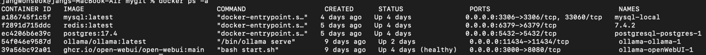
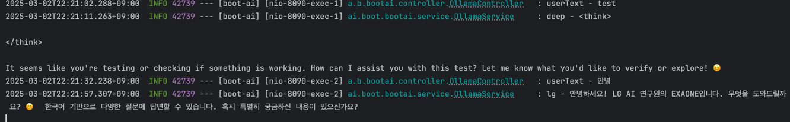
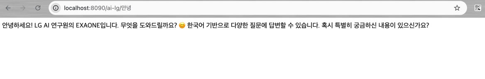
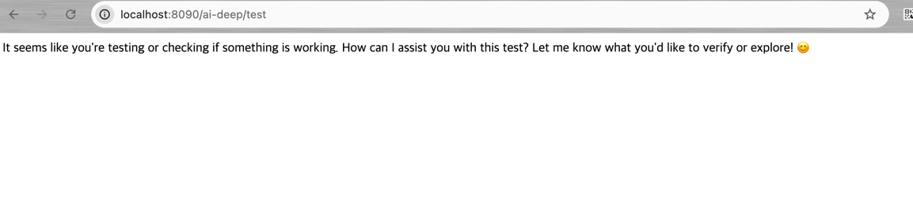

### spring ai exame

로컬 올라마 모델을 이용한
deepseek, EXAONE 2개모델을 운용하는 백엔드 프로젝트

ref= https://docs.spring.io/spring-ai/reference/api/chat/ollama-chat.html

spring git: https://github.com/spring-projects/spring-ai/tree/main/models/spring-ai-ollama

ref = chatgpt
https://platform.openai.com/settings/organization/billing/overview
결제 정보 추가하고 다시 시도.

